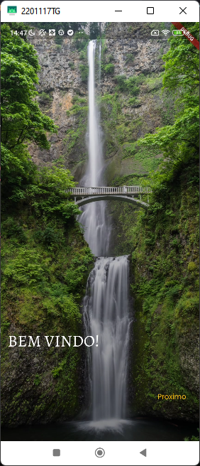
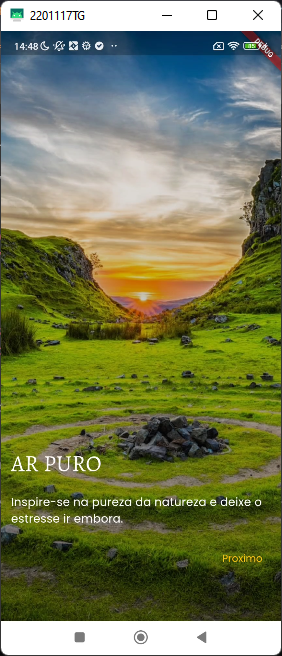
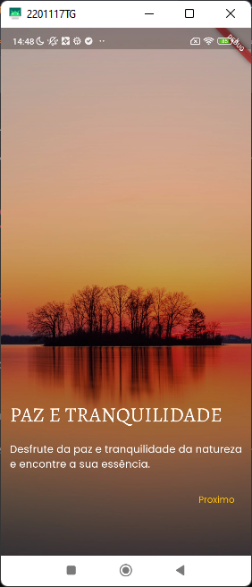

**Fade Onboarding Project**

This project is a simple and elegant onboarding that uses fade in to showcase the beauty of nature. The onboarding has five screens, each with a title and subtitle. The screens are as follows:

* **Screen 1:** Welcome to nature!
* **Screen 2:** Fresh air
* **Screen 3:** Crystal-clear water
* **Screen 4:** Colorful flowers
* **Screen 5:** Peace and tranquility

    
    
    

The onboarding is automatically started when the app is opened. The screens are presented one at a time, using fade in to smooth the transition.

**Fade in**

Fade in is an animation technique that causes an object to appear gradually. In the case of the onboarding, the images are displayed with fade in to create a smooth and pleasant effect.

Fade in can be used for different purposes, such as introducing new content, drawing attention to an element, or simply creating an aesthetic effect. In the case of the onboarding, fade in is used to create a pleasant and inviting experience for the user.

Here is a more concise version:

**Nature Onboarding**

This onboarding uses fade in to introduce users to the beauty of nature. The onboarding has five screens, each with a title and subtitle. The images are displayed with fade in to create a smooth and pleasant effect.

I hope this helps!